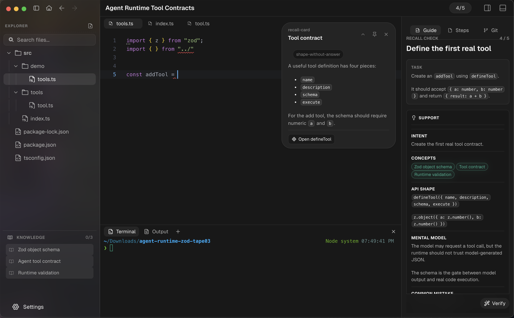

<p align="center">
  
</p>

<h1 align="center">Construct</h1>

<p align="center">
  Build real software. Learn with intent.
</p>

<p align="center">
  
  
  
  
  
</p>

<p align="center">
  <a href="https://tryconstruct.cc">Website</a> ·
  <a href="https://github.com/AbhinavMishra32/Construct-IDE/releases/latest">Download Construct 0.2.0</a> ·
  <a href="docs/tape-changelog.md">Tape changelog</a>
</p>

Construct is a desktop IDE for learning by building. A Construct tape opens as a real local project with files, an editor, a terminal, guided steps, recall checks, and agents that can inspect the work without taking ownership away from you.

<p align="center">
  
</p>

## The experience

You do not leave the project to watch a lesson, search for the next instruction, or paste your work into a separate chatbot. Construct keeps the learning loop beside the code:

- **Understand the system** through focused explanations and inspectable concept cards.
- **Build it locally** with Monaco, a real workspace, and an integrated terminal.
- **Explain your thinking** through Construct Interact and recall prompts.
- **Verify the result** against authored goals, tests, terminal evidence, and project state.
- **Keep what you learned** in a local Knowledge Base with concept and assistance history.

## Construct Interact

Construct Interact is the conversational layer inside a tape. It can inspect the current question, authored steps, concept and reference cards, learner history, scoped project files, and terminal output when those sources are relevant.

The agent chooses its tools for each message. Its activity remains visible as a compact, expandable trace, and its response preserves source provenance: wording from a concept card is identified as concept-card wording instead of being presented as part of the lesson step.

When a linked concept has not been opened, Interact can send you to the card. When it has been opened, it can use that engagement history to give a smaller, more focused follow-up.

## What a tape can contain

- Explanations grounded in the project you are editing
- Construct Interact understanding checks
- Guided edits and file navigation
- Commands, expected output, and checkpoints
- Reply or code recall
- Agent verification
- Concept and reference cards
- Generated live learning steps when existing material is not enough
- Git milestones and project progress

Tapes are plain-text `.construct` programs. They describe the workspace and learning sequence while the learner's code, terminal state, and progress remain real local data.

## Tape compatibility

Construct `0.2.0` supports every tape revision from `tape-0.1` through `tape-0.4.2`.

| Revision | Adds |
| --- | --- |
| `tape-0.1` | Files, linear steps, explain, edit, run, expect, checkpoint |
| `tape-0.2` | Focus anchors, references, supported recall, agent verification |
| `tape-0.3` | Concept cards, richer support, git milestones, authoring lint |
| `tape-0.3.1` | Canonical `guide.*` names and explicit inline references |
| `tape-0.4` | Construct Interact, reply recall, learner memory, Knowledge Base |
| `tape-0.4.1` | Validated generated live steps, actions, and run provenance |
| `tape-0.4.2` | Agent-chosen tools, source-labelled resources, concept engagement, durable agent traces |

Older `tape-0.4` and `tape-0.4.1` projects receive the current source-aware Interact behavior without requiring a tape rewrite. See the [canonical tape changelog](docs/tape-changelog.md) for the compatibility policy.

## AI providers

Construct supports OpenRouter and OpenAI-compatible model configuration from Settings. Provider, key, base URL, and per-feature model choices are shared consistently by Construct Interact, Code Ghost, verification, selection explanation, and other agent features.

Agent credentials and learning state are stored locally by the desktop app.

## Download

Download the latest installers from [GitHub Releases](https://github.com/AbhinavMishra32/Construct-IDE/releases/latest).

- macOS: `.dmg` and `.zip`
- Windows: installer, portable executable, and `.zip`
- Linux: `AppImage`, `.deb`, and `.tar.gz`

## Build from source

Requirements:

- Node.js 25+
- pnpm 10+

```bash
pnpm install
pnpm --filter @construct/app dev
```

Run the repository checks with:

```bash
pnpm verify
```

## Repository map

```text
app/                         Construct desktop app
app/src/renderer/construct/  Tape runtime, compiler, and product UI
opaline/packages/ui/         Shared desktop UI components
website/                     tryconstruct.cc
docs/                        Tape and release documentation
```

## License

License information is not finalized yet.
