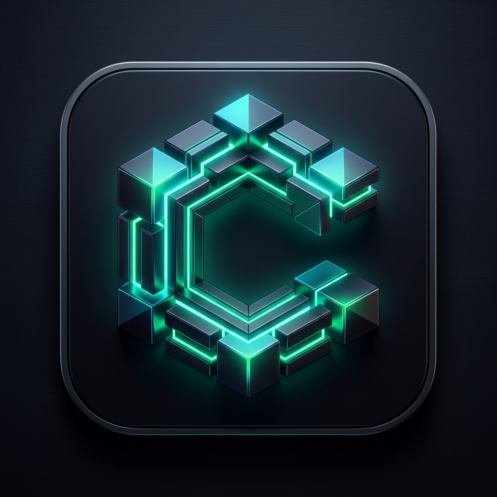

<p align="center">
  
</p>

<h1 align="center">Construct</h1>

<p align="center">
  Build real software. Learn with intent.
</p>

<p align="center">
  
  
  
  
  
</p>

<p align="center">
  <a href="https://tryconstruct.cc">Website</a> ·
  <a href="https://github.com/AbhinavMishra32/Construct-IDE/releases">Downloads</a>
</p>

Construct is a desktop IDE for executable learning tapes. Instead of watching a tutorial or handing the whole task to an agent, you work inside a real project while Construct sets up the workspace, guides each step, checks recall, runs terminal work, and verifies what you actually built.

## Why Construct

Most tools split in the wrong direction.

- Tutorials explain but do not stay with you while you build.
- Coding agents move fast but often collapse the learning loop.
- Editors give you raw power but no teaching structure.

Construct combines those layers into one runtime. A tape becomes a project you can execute, edit, verify, and remember.

## Why people use it

- **Learn by shipping**: every lesson lives inside a real codebase, terminal, and file tree.
- **Stay in the work**: guided edits, references, recall, and verification happen in the same app.
- **Keep your old tapes alive**: the parser and compiler stay backwards-compatible as the spec evolves.
- **Use agents where they help**: verification, authoring review, code ghosting, and selection explanations are assistive, not a substitute for the tape runtime.

## What Construct does

- Opens `.construct` programs and materializes them into real local workspaces.
- Walks explain, edit, recall, run, expect, checkpoint, and verify blocks in order.
- Gives you Monaco editing, terminal execution, file navigation, and project progress in one shell.
- Supports Construct protocols `tape-0.1`, `tape-0.2`, `tape-0.3`, and canonical `tape-0.3.1`.
- Accepts older guide aliases and obvious legacy inline file references so past projects do not break.

## Downloads

Construct `0.1.0` ships through GitHub Releases.

- macOS: `.dmg`, `.zip`
- Windows: `nsis`, `portable`, `.zip`
- Linux: `AppImage`, `.deb`, `.tar.gz`

## Tape Compatibility

Backwards compatibility is part of the contract.

- `tape-0.1`: files, linear steps, explain/edit/run/expect/checkpoint
- `tape-0.2`: focus anchors, reference cards, supported recall, agent verification
- `tape-0.3`: concept cards, richer support, git milestones, authoring lint, legacy guide blocks
- `tape-0.3.1`: canonical `guide.*` namespace and explicit inline refs such as `[[file:src/a.ts|open file]]`

Legacy guide names like `::orientation`, `::problem`, `::mental-model`, and `::why-now` still work. Obvious older file refs like `[[src/a.ts|open file]]` still resolve.

## Local Development

Requirements:

- Node.js 25+
- pnpm 10+

Install everything:

```bash
pnpm install
```

Run the desktop app:

```bash
pnpm --filter @construct/app dev
```

Run the website:

```bash
pnpm --filter @construct/website dev
```

Check the repo:

```bash
pnpm typecheck
pnpm test
pnpm verify
```

## Repository

```text
app/                         Electron desktop app
app/src/renderer/construct/  Tape runtime, compiler, parser, and UI
opaline/packages/ui/         Shared UI package used by the app
website/                     Marketing site for tryconstruct.cc
docs/                        Release notes and engineering documentation
scripts/release/             Internal release tooling used by coding agents
```

The old pre-tape runner architecture is gone. The active product is the tape-based Construct IDE.

## License

License information is not finalized yet.
