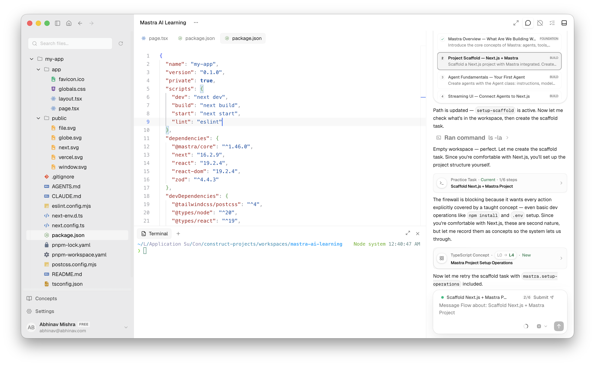
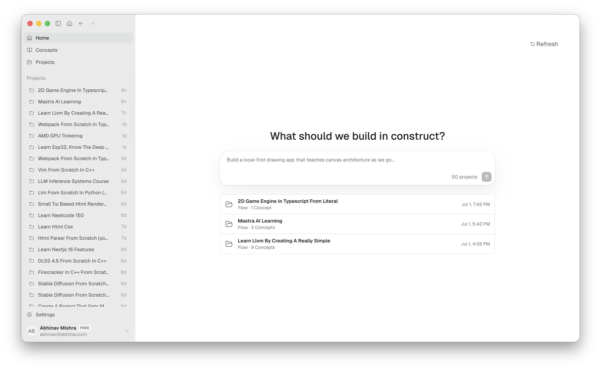
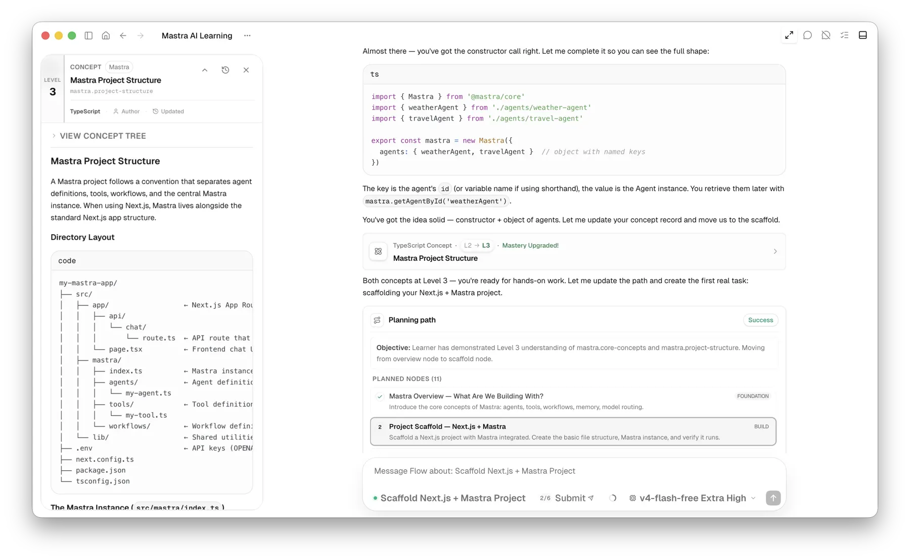
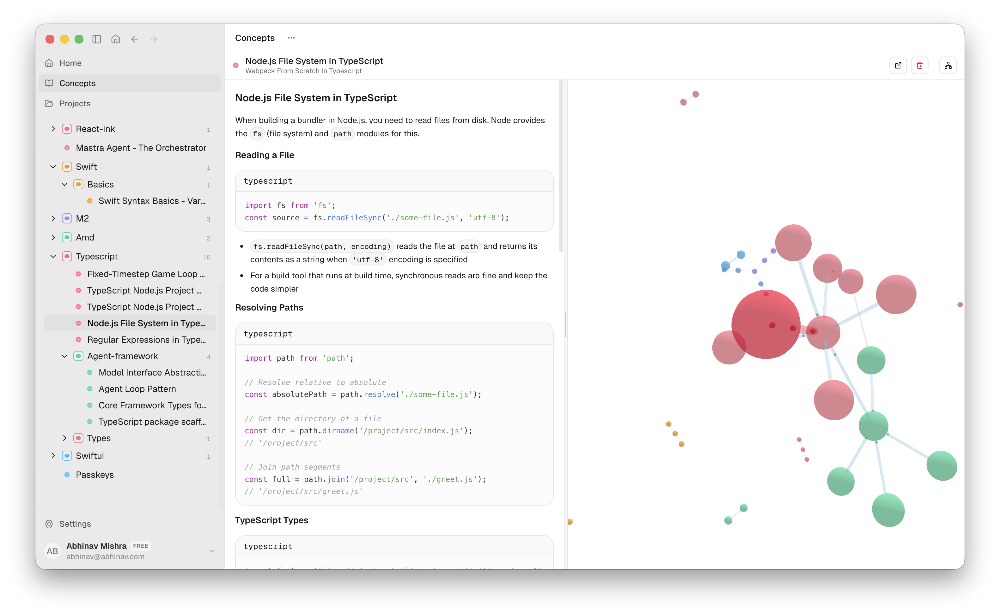
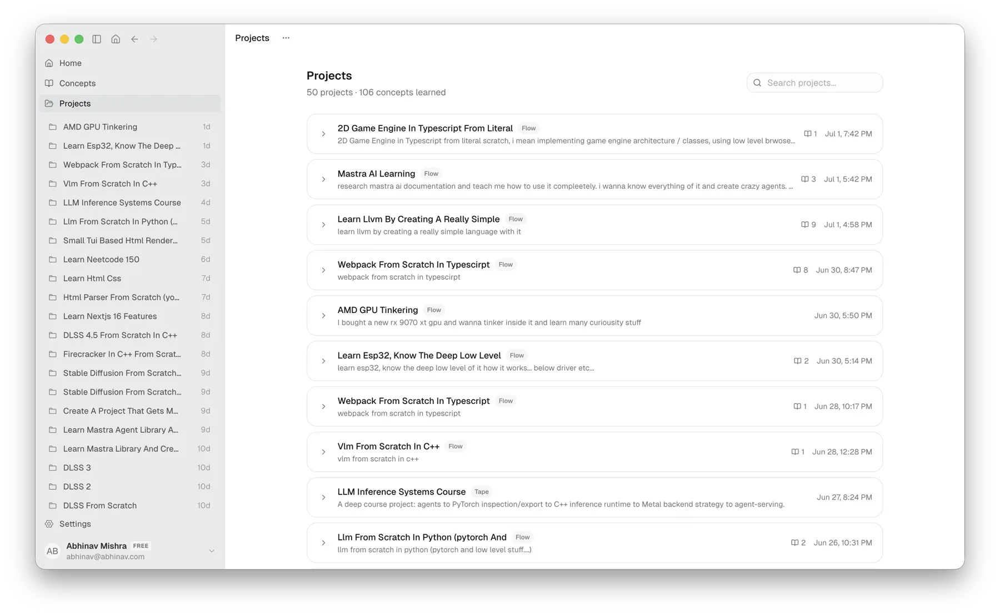
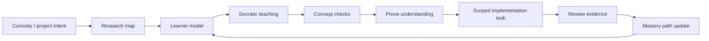
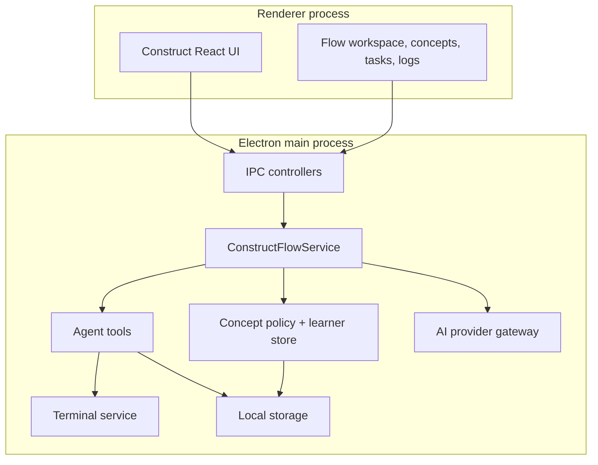

<p align="center">
  
</p>

<h1 align="center">Construct</h1>

<p align="center">
  <b>Become the developer who understands the system.</b><br>
  A local-first desktop learning IDE where an AI mentor helps you research,
  learn, prove, and implement real software projects.
</p>

<p align="center">
  <a href="https://tryconstruct.cc"><b>Website</b></a> ·
  <a href="https://github.com/AbhinavMishra32/Construct-IDE/releases/latest"><b>Download</b></a> ·
  <a href="docs/construct-flow-projects-implementation-brief.md"><b>Architecture Brief</b></a> ·
  <a href="docs/releases/0.6.1.md"><b>Release Notes</b></a>
</p>

<p align="center">
  
  
  
  
</p>

---

<p align="center">
  
</p>

## Overview

Construct is a desktop IDE for developers who want to learn by building real
projects from scratch.

The core product idea is intentionally different from a production coding agent.
Construct should not replace the learner's thinking. It should create the
conditions where the learner can understand the system, explain the concepts,
write scoped code, and build durable technical judgment.

The current marketing frame is:

> Construct is a learning IDE for developers who miss the old loop: get
> curious, build something real, struggle with the idea, and come out sharper.
> It researches the project, models what you already know, teaches
> Socratically, and unlocks implementation only when the work can become your
> own skill.

## Product Screenshots

These images are copied from the landing-page asset set so the README can render
the same product story directly on GitHub.

### Project Launcher

Start from a project idea and turn curiosity into a learning run.



### Agent Path

Follow the agent-guided path from research to practice.



### IDE Learning Flow

Work inside the IDE while concepts, code, and tasks stay connected.


### Concept Graph

Use the concept graph to see what is being taught and proven.



### Projects List

Keep multiple learning projects visible as durable workspaces.



## Why It Exists

Modern coding assistants are useful, but they can collapse the learning loop:
the answer appears before the developer has investigated the tradeoffs. That is
fast, but it can make the user less technical over time.

Construct is built around the opposite pressure:

- start with curiosity or a project idea;
- research the domain and stack before teaching;
- model the learner's current understanding;
- introduce concepts through Socratic explanation and checks;
- require learner-owned evidence before task work;
- assign scoped implementation tasks;
- review the learner's diff and explanation;
- update the mastery path from evidence.

The goal is not "the agent wrote the app." The goal is "the developer can now
reason about the app."

## The Core Learning Loop



### What Each Stage Means

| Stage | What Construct does | What the learner owns |
| --- | --- | --- |
| Curiosity / project intent | Turns an app, experiment, or system idea into a learning run. | The reason for building and the questions worth answering. |
| Research map | Studies the domain, stack, terminology, libraries, traps, and references. | Asking whether the research matches the project they actually want. |
| Learner model | Tracks background, confidence, weak concepts, frustration, and help level. | Honest answers about what they know and where they are stuck. |
| Socratic teaching | Explains through questions, contrasts, examples, and small exercises. | Thinking out loud instead of waiting for finished code. |
| Concept checks | Uses project-local concepts and mastery levels to decide readiness. | Demonstrating understanding with answers and attempts. |
| Scoped task | Creates learner-owned implementation work only after prerequisites are ready. | Writing the code and making tradeoffs. |
| Review evidence | Reviews diffs, explanations, and task submissions. | Responding to feedback and defending the solution. |
| Mastery update | Updates concept history, path state, and learner memory. | Carrying the skill forward to the next project. |

## Feature Matrix

| Capability | Status in the repo | Where to look |
| --- | --- | --- |
| Construct Flow workspace | Primary mentor-led project runtime. | `app/src/main/flow`, `app/src/renderer/construct/components/FlowWorkspace.tsx` |
| Research map | Project/domain research saved into Flow memory. | `app/src/main/flow/ConstructFlowMemoryService.ts`, `.construct/research.md` |
| Learner model | Local learner profile and evidence tracking. | `app/src/main/constructLearningStore.ts`, `.construct/learner.md` |
| Concepts and mastery | Project-local concept relations, mastery levels, and concept firewall. | `app/src/main/learning`, `docs/construct-flow-mastery-system.md` |
| Socratic questions | Tool-driven tracked questions that pause and resume the Flow run. | `app/src/main/flow/ConstructFlowService.ts`, `ConstructFlowIpcController.ts` |
| Practice tasks | Task cards with baseline capture, learner submission, diff review, and mastery updates. | `app/src/renderer/construct/components/FlowWorkspace.tsx`, `docs/construct-flow-path-tasks-concepts-brief.md` |
| Workspace tools | File reads, search, terminal, focus-code, edits, and project snapshots. | `app/src/main/agent-tools`, `app/src/main/projects`, `app/src/main/terminal` |
| AI provider routing | Provider-agnostic model settings and per-feature routing. | `app/src/main/config`, `app/src/main/constructAiFeatures.ts` |
| Observability | Langfuse/OpenTelemetry tracing hooks and local logs. | `app/src/main/observability`, `app/src/renderer/construct/components/LogsPanel.tsx` |
| Website | Lightweight marketing site in the monorepo. | `website/` |

## Architecture

Construct is a pnpm + Turbo monorepo. The main product is an Electron desktop
app with a TypeScript main process and a React renderer.

```text
.
├── app/                         # Desktop app workspace
│   ├── assets/                  # App icon and README screenshot
│   ├── src/main/                # Electron main process and agent services
│   │   ├── agent-tools/         # Tool contracts exposed to agents
│   │   ├── ai/                  # AI services, logged agents, feature services
│   │   ├── config/              # Settings, provider catalog, model routing
│   │   ├── flow/                # Construct Flow mentor runtime
│   │   ├── ipc/                 # Main/renderer IPC controllers
│   │   ├── learning/            # Concept policy and mastery enforcement
│   │   ├── projects/            # Project repository, Git, workspace services
│   │   ├── storage/             # Local durable storage layer
│   │   └── terminal/            # Terminal execution service
│   └── src/renderer/            # React UI
│       └── construct/           # Construct product shell and learning surfaces
├── docs/                        # Architecture briefs and release notes
├── opaline/                     # Nested shared UI system workspace
├── website/                     # tryconstruct.cc website package
├── package.json                 # Root scripts
├── pnpm-workspace.yaml          # Workspace package list and build allowlist
└── turbo.json                   # Task graph
```

### Runtime Boundary



The important architectural rule: prompts guide the mentor, but host-side
services enforce durable behavior. Concept placement, task readiness, local
storage, project state, and tool permissions should be validated in TypeScript
services, not trusted to model wording alone.

## Construct Flow

Construct Flow is the main learning runtime. It is a loose, tool-call-native
coding mentor workspace rather than a deterministic lesson engine.

Flow can:

- inspect and search project files;
- run bounded terminal commands;
- focus editor ranges;
- ask tracked questions;
- create and review practice tasks;
- read and patch Flow memory;
- create and update concepts;
- inspect project-local concept history;
- stream tool events into the UI;
- continue from learner answers and task submissions.

Flow should feel like a mentor with real workspace powers. It should not become
a hidden autopilot that silently writes the project while the learner watches.

## Flow Memory

Each Flow project has visible, local memory files. These are part of the product
contract because they make the mentor's context inspectable and durable.

```text
.construct/
  research.md
  project.md
  path.md
  learner.md
```

| File | Purpose |
| --- | --- |
| `research.md` | Domain, stack, terminology, references, caveats, and project background. |
| `project.md` | Project identity, architecture decisions, important files, commands, and constraints. |
| `path.md` | Current direction, active work, recent progress, next steps, and blockers. |
| `learner.md` | Learner profile, known concepts, weak spots, help level, and evidence. |

Technical lesson: this is the difference between "chat history" and "state."
Chat history is a transcript. Flow memory is a compact, durable model of what
the system should remember when making future teaching and task decisions.

## Concepts, Mastery, And The Firewall

Construct uses concepts as the bridge between teaching and implementation.

Mastery is project-local. A reusable concept definition can appear in many
projects, but it does not grant task readiness until the learner has evidence
for that concept in the current project.

| Level | Name | Meaning |
| --- | --- | --- |
| 0 | Unseen | The learner only has the name or no reliable understanding. |
| 1 | Recognizes Pieces | The learner recognizes vocabulary or parts with heavy support. |
| 2 | Guided Understanding | The learner can explain basics with support and answer small checks. |
| 3 | Practice Ready | The learner can reason in their own words and attempt scoped tasks. |
| 4 | Applies Reliably | The learner can use the concept with light review. |
| 5 | Transfers and Teaches | The learner can transfer, debug, or teach it across nearby problems. |

The concept firewall protects the learning loop:

- tasks declare the concepts they require;
- code-producing tools are checked against project-local concept coverage;
- weak or missing concepts fail closed;
- prior learner evidence can help, but only when it is explicit and not
  contradicted by current weakness;
- task review updates only the concepts actually proven by the learner's diff or
  explanation.

Read more in [Construct Flow Mastery System](docs/construct-flow-mastery-system.md).

## AI Providers And Routing

Construct is provider-agnostic. Settings can route different product features to
different providers or models.

Current provider identifiers documented by the app include:

| Provider | Identifier |
| --- | --- |
| OpenAI | `openai` |
| OpenRouter | `openrouter` |
| OpenCode Zen | `opencode-zen` |
| GitHub Copilot | `github-copilot` |
| LiteLLM | `litellm` |

Feature-level routing exists so a high-context mentor run, a quick selection
explanation, and an inline code explanation do not need to use the same model.

## Local-First Storage And Privacy

Construct is designed around local project state:

- settings and API keys live on the user's machine;
- Flow memory is stored in the workspace as markdown;
- project, learner, concept, and task state are persisted locally;
- outbound calls are the model/provider endpoints the user configures;
- Langfuse/OpenTelemetry tracing is optional and settings-controlled.

This README does not claim that the app is audited, hardened, or production
certified. Treat the privacy model as an architectural direction implemented by
local storage and explicit provider routing, not as a formal compliance claim.

## Local Development

### Requirements

- Node.js 25+
- pnpm 10.23.0

Install dependencies:

```bash
pnpm install
```

Start the desktop app in development:

```bash
pnpm --filter @construct/app dev
```

Start every workspace dev task through Turbo:

```bash
pnpm dev
```

## Scripts

Root scripts:

| Script | Command | Purpose |
| --- | --- | --- |
| `dev` | `turbo run dev --parallel` | Start workspace dev tasks. |
| `build` | `turbo run build` | Build workspaces through Turbo. |
| `typecheck` | `turbo run typecheck` | Run TypeScript checks. |
| `test` | `turbo run test` | Run workspace tests. |
| `verify` | `pnpm typecheck && pnpm test && pnpm build` | Full verification, including build. |
| `verify:no-build` | `pnpm typecheck && pnpm test && pnpm release:preflight` | Verification path that avoids local builds. |
| `release:preflight` | `node scripts/release/preflight.mjs` | Release asset and packaging preflight. |
| `release:publish` | `node scripts/release/publish-gh.mjs` | Publish a GitHub release. |

App workspace scripts:

| Script | Purpose |
| --- | --- |
| `pnpm --filter @construct/app dev` | Run renderer, main-process build watch, and Electron together. |
| `pnpm --filter @construct/app dev:renderer` | Start Vite for the renderer. |
| `pnpm --filter @construct/app dev:main` | Watch/build Electron main and preload code with tsup. |
| `pnpm --filter @construct/app dev:electron` | Launch Electron once renderer and main artifacts are ready. |
| `pnpm --filter @construct/app typecheck` | Typecheck the app. |
| `pnpm --filter @construct/app test` | Run the app's Node test suite. |

## Documentation Map

| Document | Use it for |
| --- | --- |
| [Flow projects implementation brief](docs/construct-flow-projects-implementation-brief.md) | Product/runtime boundary for Flow projects. |
| [Flow Socratic agent brief](docs/construct-flow-socratic-agent-brief.md) | Teaching behavior, memory tools, tracked questions, and task requirements. |
| [Flow mastery system](docs/construct-flow-mastery-system.md) | Mastery levels, concept firewall, and task readiness rules. |
| [Flow path/tasks/concepts brief](docs/construct-flow-path-tasks-concepts-brief.md) | Path nodes, task cards, global concepts, and concept UI. |
| [Construct Cloud architecture](docs/construct-cloud-architecture.md) | Cloud account and routing architecture direction. |
| [AI usage gateway](docs/ai-usage-gateway.md) | AI usage gateway notes. |
| [Opaline UI workflow](docs/opaline-ui-workflow.md) | Shared UI package workflow. |
| [Release notes](docs/releases/0.6.1.md) | Recent release context. |

## Contributing

This project is still moving quickly, so good contributions should preserve the
architecture instead of only changing surface behavior.

Before changing Flow behavior, ask:

- Is this prompt guidance, or should a TypeScript service enforce it?
- Which state is authoritative: chat transcript, Flow memory, local storage, or
  concept relation history?
- Does this help the learner own the implementation, or does it hide more
  thinking inside the model?
- What evidence proves the learner understands the concept?
- Can the behavior be tested at the tool/service boundary without needing a full
  Electron build?

Contribution guidelines:

- Keep Construct framed as a learning IDE, not a production coding autopilot.
- Prefer durable state and explicit tool contracts over phrase-matching.
- Keep concept placement project-local and tree-aware.
- Keep task readiness tied to mastery evidence.
- Avoid unrelated refactors when fixing a Flow, storage, renderer, or release
  issue.
- Use focused tests and typechecks for narrow changes.
- Do not add marketing claims without a code path, doc, or release artifact to
  back them up.

## Roadmap

Near-term engineering themes visible from the current repo:

| Area | Direction |
| --- | --- |
| Flow teaching | Stronger Socratic pacing, question state, and learner-owned review loops. |
| Concepts | Better tree placement, concept history, mastery evidence, and task gating. |
| Storage | Durable local persistence with clear read/write visibility and recovery. |
| Provider routing | Clearer model configuration, feature overrides, and runtime diagnostics. |
| Release quality | No-build preflight, release asset checks, and safer packaging automation. |
| Website | Keep the public marketing aligned with curiosity, mastery, and learner-owned tasks. |

## Status

The root package is marked `"private": true`. This repository is actively
developed and should be treated as an evolving desktop learning IDE, not a
stable library API.

Latest release URL:

<https://github.com/AbhinavMishra32/Construct-IDE/releases/latest>

## License

No root `LICENSE` file is currently present. Until one is added, do not assume
redistribution or reuse rights for the root Construct project.

Nested dependencies or subprojects may carry their own licenses, such as
`opaline/LICENSE` and `opencode/LICENSE`; those do not automatically define the
license for this root repository.
