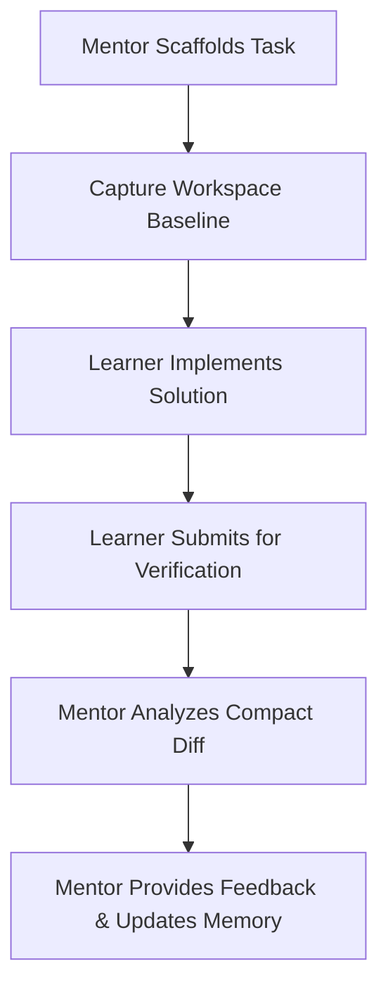

<p align="center">
  
</p>

<h1 align="center">Construct</h1>

<p align="center">
  <b>An AI-native desktop IDE that teaches you to build.</b><br>
  An interactive workspace where a coding mentor lives beside your editor,<br>
  understands what you are learning, and guides you through real software development.
</p>

<p align="center">
  <a href="https://tryconstruct.cc"><b>Website</b></a> ·
  <a href="https://github.com/AbhinavMishra32/Construct-IDE/releases/latest"><b>Download</b></a> ·
  <a href="docs/construct-flow-projects-implementation-brief.md"><b>Architecture Spec</b></a>
</p>

<p align="center">
  
  
  
  
</p>

---

## What is Construct?

Construct is an **AI-native desktop IDE** built for one reason: to help you learn by building real software.

Unlike coding assistants that hand you copy-paste solutions, Construct works like a senior engineering mentor. It sits beside your editor, inspects your workspace, understands what you are building, and guides you through the decisions that matter. You write the code. Construct helps you understand *why* it works.

---

## Core Architecture: The Mentorship Loop

When you open a project, Construct runs two specialized agents:

### 1. The Research Agent
Runs once at project creation. It performs deep domain and stack research—searching the web, reading documentation, identifying terminology, finding common libraries, and flagging potential caveats. It saves everything into `research.md` so the mentor agent is never flying blind.

### 2. The Mentor Agent
The primary coding companion in your workspace. It possesses full access to project context and workspace tools:
- 📂 **File Inspection** – Read, search, list, and navigate any file in your project.
- 🐚 **Terminal Control** – Run tests, build projects, run linters, and debug errors.
- 🎯 **Practice Scaffold** – Setup boilerplate tasks and wait for you to write the implementation.
- 👁️ **Editor Focus** – Open files and highlight exact line ranges to direct your attention.
- 🌐 **Web Search** – Query libraries, APIs, and documentation in real time.

---

## Construct Memory

To maintain state and context across sessions, Construct persists durable metadata in four markdown files within your workspace directory (configurable via the Settings tab):

| File | Description |
| :--- | :--- |
| `research.md` | Compiled domain and technology stack research. Created by the Research Agent. |
| `project.md` | Durable project identity: tech stack, architecture decisions, conventions, and run commands. |
| `path.md` | Current direction: active goals, completed tasks, next steps, and blockers. |
| `learner.md` | Profile of your understanding: known concepts, weak spots, help level, and learning evidence. |

As you work, the mentor reads and writes to these files. You can close the IDE, reopen it tomorrow, and the mentor will pick up exactly where you left off, remembering what you already understand.

---

## Practice Tasks

Practice Tasks are the core learning vehicle in Construct. When the mentor agent determines it is time for a coding exercise:



1. **Scaffold**: The mentor sets up boilerplate code/tests or specifies exactly where you should work.
2. **Baseline**: It captures a snapshot of relevant files.
3. **Attempt**: You write code, test your solution, and iterate.
4. **Diff & Review**: Upon submission, the mentor receives a compact diff of your changes. It reviews your code, provides actionable feedback, and updates your memory profiles.

---

## AI Providers

Construct is provider-agnostic. Configure your preferred LLM backend in Settings, and all agent features will adapt.

### Supported Providers

| Provider | Identifier | Default Model |
| :--- | :--- | :--- |
| **OpenAI** | `openai` | `gpt-5-mini` |
| **OpenRouter** | `openrouter` | `deepseek/deepseek-v4-flash` |
| **OpenCode Zen** | `opencode-zen` | `gpt-5.1-codex` |
| **GitHub Copilot** | `github-copilot` | `github_copilot/gpt-4` |
| **LiteLLM** | `litellm` | `openai/gpt-5-mini` |

> [!TIP]
> You can target custom, self-hosted, or proxy endpoints by modifying the base URL settings for any provider.

### Agent Runtimes

Construct supports two agent runtimes, selectable in Settings:
- **Mastra** (Default)
- **Fxpnt**

### Per-Feature Model Routing

Each AI-driven capability can be routed to a different model, optimizing for cost, latency, or capability:

| Feature ID | Target Service |
| :--- | :--- |
| `construct-flow` | Construct Mentor — the primary coding workspace mentor. |
| `selection-explain` | Highlight explanation — answers queries about selected blocks. |
| `code-explain` | Inline help — provides quick contextual details while reading or editing. |

Model resolution follows a clear fallback chain:
1. **Feature-specific override** (if set in settings)
2. **Global provider model**
3. **Hardcoded default** for the provider/feature combo

---

## Observability & Privacy

- 📊 **Phoenix Tracing**: Construct supports OpenInference/Phoenix tracing. Enable it in Settings to capture agent runs, tool calls, and LLM traces.
- 🔒 **100% Local**: All API keys, settings, and learning memory files are stored locally on your machine. Construct does not collect telemetry or store code on external servers. The only outbound calls are the LLM APIs you configure.

---

## Development

### Requirements
- **Node.js** 25+
- **pnpm** 10+

### Build & Run
```bash
# Install dependencies
pnpm install

# Start Electron in development
pnpm --filter @construct/app dev

# Run workspace validations
pnpm verify
```

---

## Repository Map

```
app/                         Desktop app (Electron + React + TypeScript)
├── src/main/                Main process — agents, configurations, and services
│   ├── flow/                Construct core mentor service and Memory manager
│   └── agent-tools/         Agent tool implementations (files, terminal, tasks)
├── src/renderer/            Renderer process — UI interface, workspace layout
opaline/packages/ui/         Shared desktop UI components
website/                     tryconstruct.cc
docs/                        Technical specifications & design documents
```

---

## License

License information is not finalized yet.
